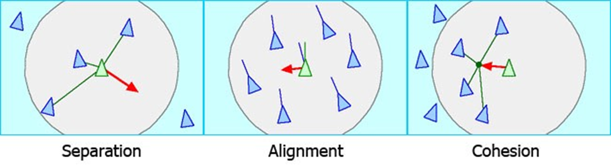

# CSx810-FinalProject

This is my final project for CSCI x810 - Computer Graphics for Fall 2021 at UGA with Dr. Hybinette. For this project, I implemented Boids, an animal flock simulation in Unity.  

## Milestones
#### Milestone 1
* Project Setup
* Custom Shaders
* Simple Boid Logic (Movement, Rotation)
* Wall Boundaries

#### Milestone 2
* Implement Boid Rules (Separation, Alignment, Cohesion)
* Add collision detection for boids (Walls, Objects)
* Create Boid Playground with many objects to navigate (cubes, Spheres, Torus, etc.)

#### Milestone 3
* Add controls to change aspects of Boids.
* Add additional Rules (Leadership, Swarms/Racism, etc.) 
* Use a better Model for the boids 
* Add compute shader (for telling which boids are near each other)

#### Milestone 4
* Implement a more animalistic flock formation (V-formation, torus, diamond, etc.)
* Add other formation options for the type of flock the boids will follow (fish, ants, locusts, etc.)

## TODO
* Slides (PDF) - 1) Clickable link on google sheet, and 2) submitted on Odin in directory, 5-7 slides, Clickable link on google sheet -- Before Presentation, OK to make refinements and then submit refinements by `(Tu 12/14)`
* Code/Software Demo-able - Refinements, cleaning up code, commenting can be submitted after demo `(Th 12/16)`
* Software/Code - Effort Level 2 x regular project. `(Tu 12/14)`
* Video/Demo - Link - on piazza FE thread. 3-5 minutes. `(Th 12/16)`
* Final Report (Survey Monkey)		Q/A Survey monkey. `(Th 12/16)`
* Check List. `(Th 12/16)`

## Sources
* Original paper by Craig Reynolds: https://www.red3d.com/cwr/papers/1987/boids.html
* Youtuber that introduced me to boids: https://www.youtube.com/watch?v=bqtqltqcQhw
* Animalistic flocks: https://www.wired.com/2013/03/powers-of-swarms/
* Formation techniques: https://cobweb.cs.uga.edu/~maria/papers/icra-2000.pdf
* Boids implementation help: 
    * https://www.youtube.com/watch?v=mhjuuHl6qHM
    * https://github.com/jqlee85/boids/blob/master/js/boid.js
    * https://www.dawn-studio.de/tutorials/boids/